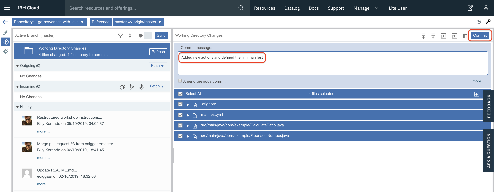
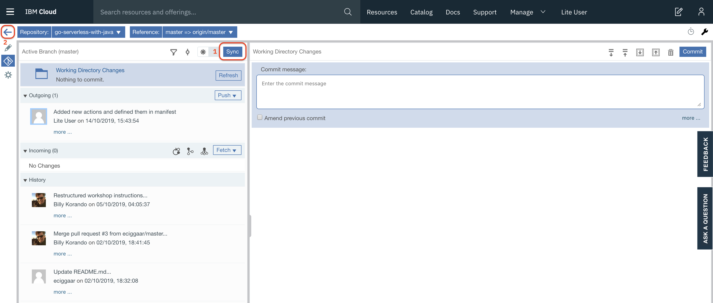

# Commit and Sync Changes with your GitLab Repo

To commit your changes to the GitLab repo and to push them to the master branch, CTRL-click the git icon (1) on the left hand side in your **Web IDE**. 

This opens the GitLab repo in a separate tab with the files that have either been added or changed. Next, enter a commit message in the designated text area and click **Commit**.

Finally, click **Sync** (1) to push the changes to the master branch. Next, click the 'Back to Toolchains' button (2) to return to the toolchain overview page. Select the **Delivery Pipeline** tile to monitor the progress of your new build. The pipeline got triggered by the push of your changes to the master branch.

Once the two stages in the pipeline successfully completed, go to the [Cloud Functions](https://cloud.ibm.com/functions/actions) section in IBM Cloud to see the result of the deployment.
