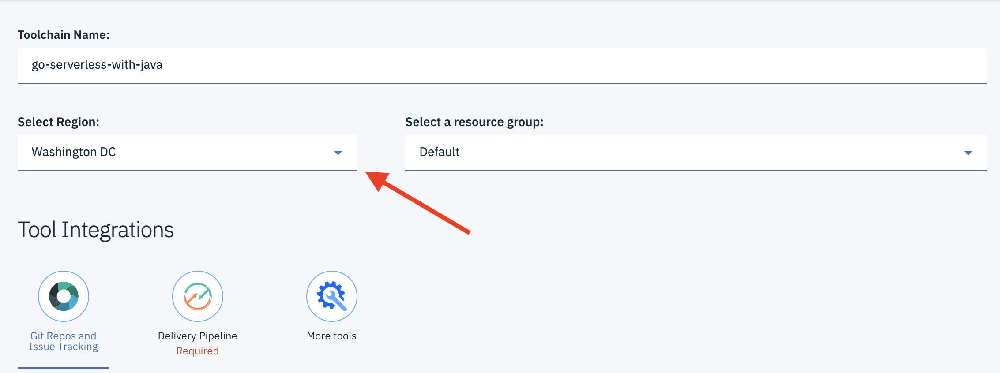
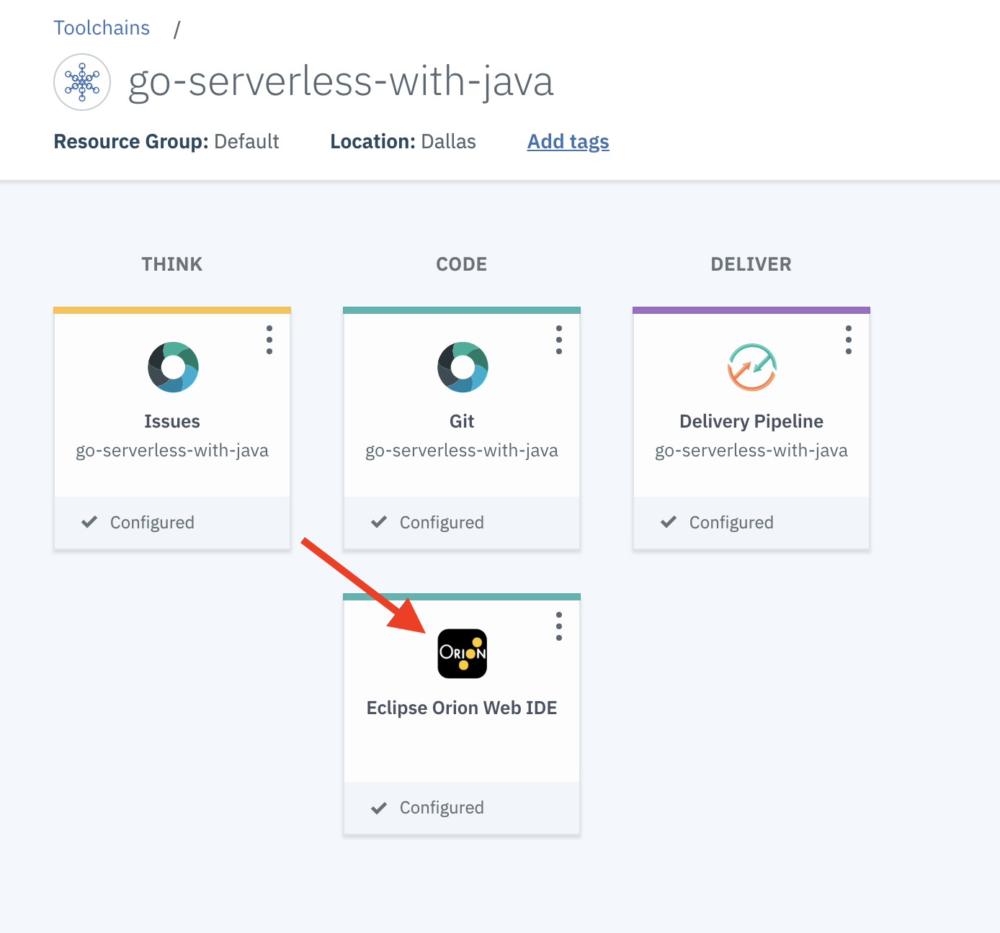

# Go Serverless with Java

Serverless functions are an emerging technology for decomposing business operations into very fine grain chunks of code. Functions provide advantages to organization by increasing agility and cost savings by allowing "scale to zero" when a function is no longer being actively used.

In this workshop we will look at how to write Serverless Functions in Java and run them on [Apache Openwhisk](https://openwhisk.apache.org/) hosted on IBM Cloud. 

## Prerequisites: 
<details>
  <summary>Click to expand</summary>
Here are the steps for configuring a Mac machine for this quicklab
  
1. Install Java 8+

	```
	brew cask install java
	```
2. [Install IBM Cloud CLI](https://github.com/IBM-Cloud/ibm-cloud-cli-release/releases/)
3. Install IBM Cloud Functions Plugin

	```
	ibmcloud plugin install cloud-functions
	```
4. Install git
	```
	brew install git
	```	

</details>


## 0. Setup

1. <a href="https://ibm.biz/BdzhjJ"  target="_blank">Create an IBM Cloud Account</a>
2. Open terminal
3. Login into IBM Cloud CLI: 

	```
	ibmcloud login
	```
4. Configure the CLI:

	```
	ibmcloud target --cf
	```
4. Clone repo: 

	```
	git clone https://github.com/wkorando/java-serverless-quicklab.git
	```
5. Change directory to cloned repo:

	```
	cd serverless-java-quicklab
	``` 	

## 1. Execute a Serverless Function with the IBM Cloud CLI

1. Run the following command to invoke a test function from the command-line:

   ```
   ibmcloud wsk action invoke whisk.system/utils/echo -p message hello --result
   ```
   
   You should get back a result that looks like this:
   
   ```
   {
       "message": "hello"
   }
   ```

	This command verifies that IBM Cloud CLI is configured correctly . If this does not work, please contact the workshop organiser to provide assistance!

## 2. Build and Deploy your First Serverless Java Function

Let's build and deploy our own Java serverless function.

1. Build and jar the Java application:

	```
	./mvnw package
	``` 
2. Deploy the function to IBM Cloud:

	```
	ibmcloud wsk action create helloJava target/hello-world-java.jar --main com.example.FunctionApp
	```
3. Execute the function:

	```
	ibmcloud wsk action invoke --result helloJava --param name World
	```
	
	You should see:
	
	```
	{
	    "greetings": "Hello World"
	}
	```

`--result` means just show the results. Omit that, and see what you get back :)
This also adds the `--blocking` flag, discussed below.

## 3. Getting Familiar with OpenWhisk Commands

Let's take a deeper look at some of the common commands you will be using when running functions on OpenWhisk.

### Executing Functions Asynchronously

So far we have been executing functions synchronously with the `--result` tag. Let's take a look at executing functions asynchronously. 

1. To execute a function in asynchronous mode simply omit `--result` when invoking the function:  

	```
	ibmcloud wsk action invoke helloJava --param name World
	```
	
   You should get a response that includes an id you can use to look up the result of the function later:
   
    ```
    ok: invoked /_/helloJava with id c51e11cf3bad42a39e11cf3badb2a3a3
    ```
    
2. Use the below command to retrieve the result of the function invocation:
    
    ```
    ibmcloud wsk activation result [id]
    ```
    You should get a response that looks something like this:
    
    ```
	{
	    "greetings": "Hello World"
	}
	```
	
	**Note:** Functions execute in asynchronous mode by default, you can also use the tag `--blocking` explicitly invoke a function in asynchronous mode.

### Viewing Function Invocation Information

When invoking a function OpenWhisk is generating diagnostic information that can be used for tracking system usage, debugging, and other purposes. 

1. You can view the invocation information of the function we executed earlier with this command:

	```
	ibmcloud wsk activation get [id]
	```
	
	You should get a response back that looks something like this:
	
	```
	{
	    "namespace": "[youremail]@mail.com_dev",
	    "name": "helloJava",
	    "version": "0.0.1",
	    "subject": "[youremail]@mail.com",
	    "activationId": "c51e11cf3bad42a39e11cf3badb2a3a3",
	    "start": 1568061913141,
	    "end": 1568061913482,
	    "duration": 341,
	    "response": {
	        "status": "success",
	        "statusCode": 0,
	        "success": true,
	        "result": {
	            "greetings": "Hello! Welcome to OpenWhisk"
	        }
	    },
	    "logs": [
	        "2019-09-09T20:45:13.478869Z    stderr: Sep 09, 2019 8:45:13 PM com.example.FunctionApp main",
	        "2019-09-09T20:45:13.478917Z    stderr: INFO: invoked with params:"
	    ],
	    "annotations": [
	        {
	            "key": "path",
	            "value": "[youremail]@mail.com_dev/helloJava"
	        },
	        {
	            "key": "waitTime",
	            "value": 514
	        },
	        {
	            "key": "kind",
	            "value": "java:8"
	        },
	        {
	            "key": "timeout",
	            "value": false
	        },
	        {
	            "key": "limits",
	            "value": {
	                "concurrency": 1,
	                "logs": 10,
	                "memory": 256,
	                "timeout": 60000
	            }
	        },
	        {
	            "key": "initTime",
	            "value": 308
	        }
	    ],
	    "publish": false
	}
	```
	
	
### Viewing Function Invocation Logs

`ibmcloud wsk activation get` returns the logs from an invocation, but you can also just view the logs from innvocation to make debugging a bit easier. 

1. To view the logs from an invocation run the following:

	```
	ibmcloud wsk activation logs [id]
	```
	You should get a return thaty looks like this:
	
	```
	2019-09-09T21:16:27.917303Z    stderr: Sep 09, 2019 9:16:27 PM com.example.FunctionApp main
	2019-09-09T21:16:27.917347Z    stderr: INFO: invoked with params:
	```	
2. For longer running functions, you can tail the logs a function is producing with the following command:

	```
	ibmcloud wsk activation poll [id]
	```

### Retrieve Most Recent Function Execution

For shorthand purposes you can use the tag `--last` in-lieu of an id to retrieve information about an activation. 

```
ibmcloud wsk activation [get|result|logs] --last
```

### Show Recent Function Invocations 

You can view recent function invocations; id, function executed with the following:

```
ibmcloud wsk activation list
```

### Show Available Functions

You can view a list of all functions available in the current namespace with the following:

```
ibmcloud wsk list
```

## 4. Creating Web Actions

Functions can be setup so they can be called directly over http as well. Let's take a look at how to do this.

1. To allow a function to be executed over http run the following command:

	```
	ibmcloud fn action update helloJava --web true
	```
	
2. To find the url to execute the function run the following:

	```
	ibmcloud wsk action get helloJava --url
	```
	
	This command will return with the url to call you function:
	
	```
	https://[region].functions.cloud.ibm.com/api/v1/web/SAMPLE_URL/default/helloJava
	```
	
3.	Because this command is return JSON, we will need to append the end of the url with `.json` when calling it: 

	```
	curl -i https://[region].functions.cloud.ibm.com/api/v1/web/SAMPLE_URL/default/helloJava.json
	```
	
4. 	You might have noticed the result was different this time. Previous we have been passing the param name to the function when invoking it through the command line `--param name World`. We can accomplish this same behavior by passing a value as a query param (e.g. `?name=World`):

	```
	curl -i https://[region].functions.cloud.ibm.com/api/v1/web/SAMPLE_URL/default/helloJava.json?name=World
	```


## 5. Use Functions to Return HTML

So far we have been just return JSON from our function, but functions are more flexible than that! Let's setup a function to return HTML: 

1. Change the current directory we are in to the root package of our Java app:

	```
	cd src/main/java/com/example
	```
2. Create and open a new Java file `WebHello.java` with this command:

	```
	vi WebHello.java
	```
3. Copy in the body of the Java file:

	```
	package com.example;

	import com.google.gson.JsonObject;
	import com.google.gson.JsonPrimitive;
	
	import java.util.logging.Logger;
	
	/**
	 * Hello FunctionApp
	 */
	public class WebHello {
	  protected static final Logger logger = Logger.getLogger("basic");
	
	  public static JsonObject main(JsonObject args) {
	
	    JsonObject response = new JsonObject();
	    JsonPrimitive nameArg = args.getAsJsonPrimitive("name");
	
	    String result;
	    if (nameArg == null) {
	      result = "Welcome to OpenWhisk";
	    } else {
	      result = "Hello " + nameArg.getAsString();
	    }
	    response.addProperty("body", "<html><body><h3>" + result + "</h3></body></html>");
	
	
	    logger.info("invoked with params:");
	    return response;
	  }
	}
	```
4. Save and exit from vi by typing `:wq` 

5. 	Return to the root of the repo:

	```
	cd ../../../../..
	```
6. Rebuild the Java .jar

	```
	./mvnw package
	```	
	
7. Functions can be updated if you want to change their behavior. To our existing fuinction run the following command:

	``` 
	ibmcloud wsk action create webHello target/hello-world-java.jar --main com.example.WebHello --web true 
	``` 

4. Get the url for the function with the following command like earlier:

	```
	ibmcloud fn action get webHello --url
	```

5. Invoke the url directly from the your web browser

6. Like earlier, you can change the `name` query parameter to change the value being returned.


## 6. Deployment Pipeline
Currently we are deploying functions directly from our local computer. This process of building and deploying functions won't work with in an organization. Let's setup a deployment pipeline that will build and deploy our pipeline when we push changes to a git repository. 

Let's create a deployment pipeline by running through the following steps:

1. [](https://cloud.ibm.com/devops/setup/deploy?repository=https://github.com/wkorando/go-serverless-with-java&branch=master&env_id=ibm:yp:us-south)

2. Verify the region is set to the same region your functions reside in:
	

	Here is the list of the regions. Match the region in the list to the region we were using when calling the functions over the web in the earlier lessons:
	```
	au-syd          Sydney   
	jp-osa          Osaka   
	jp-tok          Tokyo   
	kr-seo          Seoul   
	eu-de           Frankfurt   
	eu-gb           London   
	us-south        Dallas   
	us-east         Washington DC   
	```

3. Next create an API Key for this repo by clicking **Delivery Pipeline** and then the **+ Create** button. The default values that are generated should be fine. 

	
	
4. Cick the **Create** button in the top right corner of the page. 
5. After a few moments click the **Eclipse Orion Web IDE** card in the middle of the page. When making code changes, we will use this web based IDE as it has been pre-configured to communicate with the newly created GitLab repo.
	

With these steps we have created a deployment pipeline. When we did this IBM Cloud clone the github repository of this workshop and greate a gitlab repo hosted on IBM Cloud. We then updated git to point to the newly created gitlab repo. Now when we push changes, this will kick off the the deployment pipeline!

## 7. Viewing the Functions Dashboard

IBM Cloud provides a convenient dashboard for viewing your functions. You can access this dashboard here: [https://cloud.ibm.com/functions/actions](https://cloud.ibm.com/functions/actions)


## 8. API Gateway


## 9. Sequences

Serverless functions should by design be small nearly atomic actions. This means that a single serverless function often does not provide a lot of value. In this section we will setup a Sequence. This will alllow us to pass the returned value from one function to another. 

## 10. Connecting to Services

IBM Cloud has a catalog of services available to handle the needs of the enterprise. In this step we will connect our function to the Watson service to help calculate a value. 

## 11. Triggers 

Triggers can be used to define conditions for the execution of a function. This can be useful for scheduling a function to execute on a certain schedule or when a certain defined limit has been reached. 


