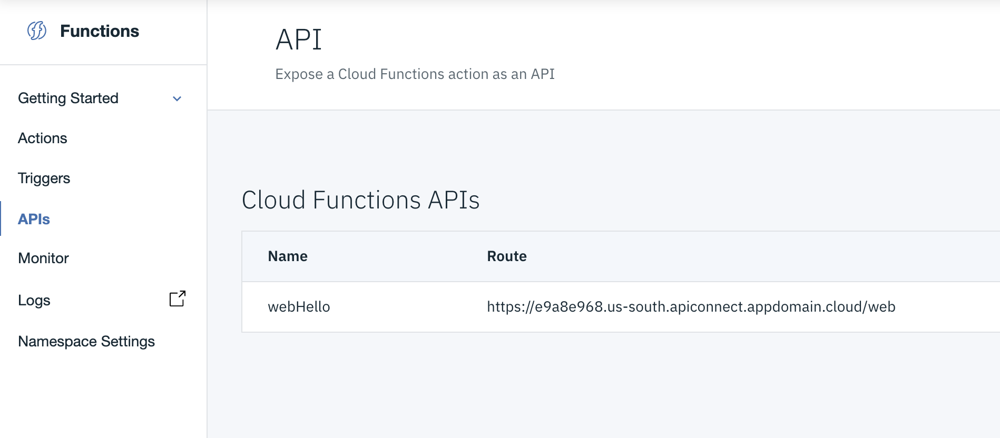
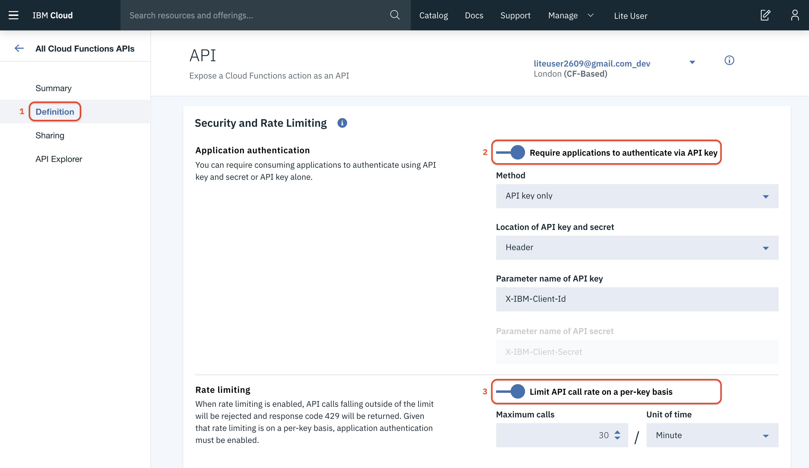
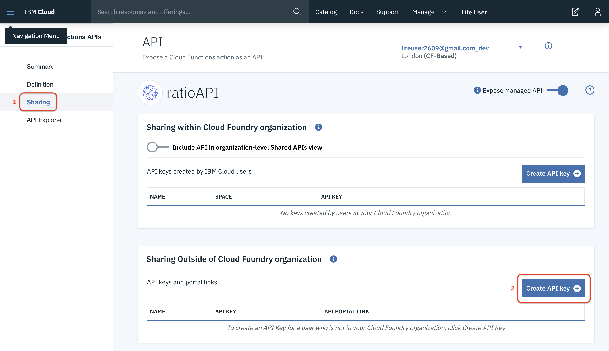
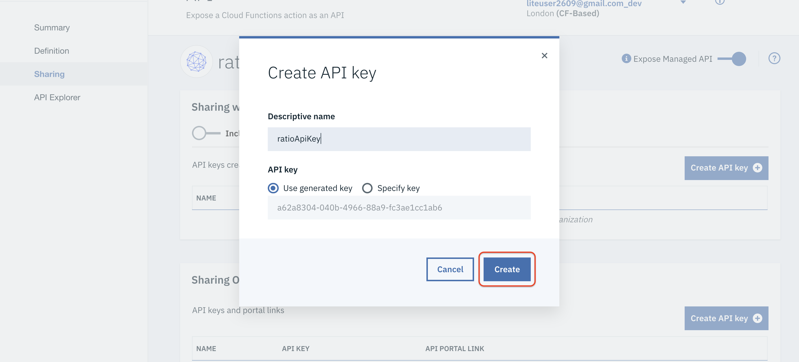
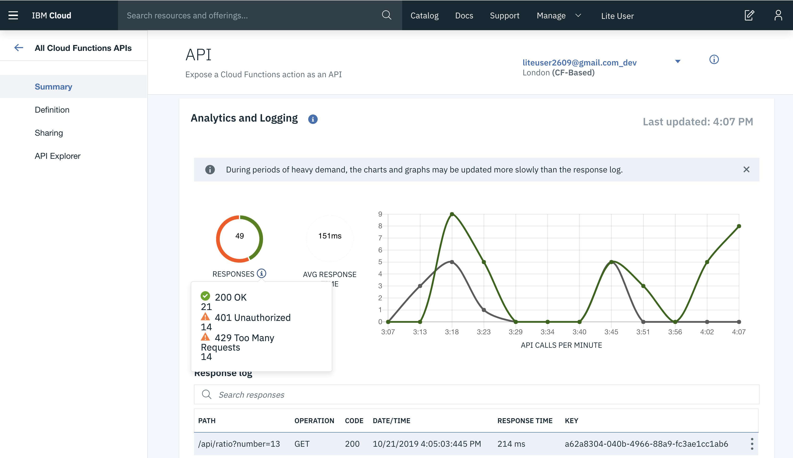
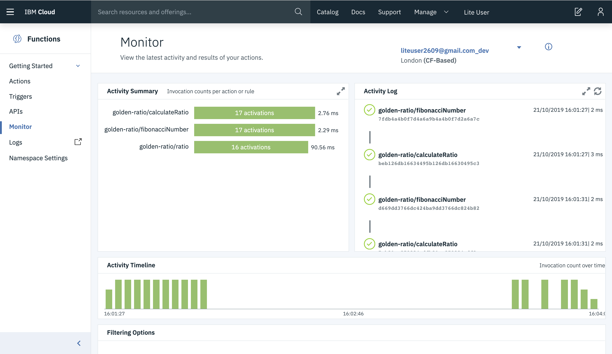

## 9. Calling Functions Through the API Gateway

An API Gateway can be a great way to make your functions and sequences more accessible and to monitor their usage. Let's update the `ratioWeb` sequence we created earlier to be accessible through the API Gateway IBM Cloud provides. 

**Note:** For a function or sequence to be accessible through the API gateway, it must also be enabled as a web action.

1. To define a new API, we need to append to the end of **manifest.yml** the following:

	```yaml
    apis:
      ratioAPI: #Endpoint ID
        api: #API Basepath
          ratio: #Endpoint Path
            ratio: #Function Reference
              method: GET
              response: json
	```
	
	Make sure the `apis` section has the same indentation as the `actions` and `sequences` sections of the **manifest.yml**. Note in the above configuration the different entries for labeling the API, for defining its base path, endpoint path, function / sequence to invoke, etc. 

	---	
	**Tip:** For an expanded view of what the `manifest.yml` file should look like, and where all the elements go, look at the end of this section.
	
	---
	 
2. Commit and push these changes via the Web IDE to trigger the deployment pipeline. Check the [Commit and Sync Changes with your GitLab Repo](GIT.md) section of this workshop if you're not sure anymore how to do this.

3. Once the build has completed open the [Functions API Management](https://cloud.ibm.com/functions/apimanagement) page and click the **ratioAPI** row. It should look something like this:

	

4. This opens the management page for the API endpoint. Under **Route** is the route to the endpoint. Copy that value and append the endpoint path `ratio?number=5` to it. This will -- via the `ratioAPI` -- execute the `ratio` sequence with query parameter `number` set to 5. Test some other numbers as well and look how this changes the ratio. The bigger the number, the closer it gets to the golden ratio.

### Rate Limiting 

There are a number of ways you can configure your API. A common one would be rate limiting. Because with functions you are paying for every CPU cycle, limiting the number of times a function can be executed can be a great way of making sure you don't get stuck with a huge bill at the end of the month -- because e.g. a script or application got stuck in an endless loop. 

1. As rate limiting is measured per API key, we first need to set security on the API and create a key to access our API. For this, click the API on the [Functions API Management](https://cloud.ibm.com/functions/apimanagement) page.
	
	

	Next, click **Definitions** (1) on the left-hand side. Then, in the **Security and Rate Limiting** section, turn on both **Require applications to authenticate via API key** (2) and the **Limit API call rate on a per-key basis** (3) switches. Set **Maximum calls** to 20 and the **Unit of time** to Minute. Finally, scroll to the bottom of the page and click **Save** to save the changes.

2. Now that the rate limiting and the security are set, we need a key so that we can call the API. For this, select the **Sharing** tab (1) on the lef-hand side of the page.

	

	Click **Create API key** (2) under **Sharing Outside of Cloud Foundry organization** and provide a name for the key. Click **Create** to complete the creation of the key.

	

3. Next, we will use `curl` and some basic `bash` scripting to demonstrate the working of rate limiting on our API. We start by calling the API once and check the result.
	```bash
	curl -H 'x-ibm-client-id: <your_apikey>' -H 'accept: application/json' https://<your-apiurl>.eu-gb.apiconnect.appdomain.cloud/api/ratio?number=5
	```
	
	Make sure to replace the API endpoint URL with your own. The result should be similar to
	
	```json
	{
	   "ratio": 1.666666666666667
	}
	```
	
	A rate limit of 20 calls per minute will be translated to one every 3 seconds. So, if we define a loop that calls the API 10 times in a row -- without sleeping -- the majority of those calls should be rejected. Let's try this by opening a Bash-like shell. Type the following command:

	```bash
	for i in {3..13}; do curl -H 'x-ibm-client-id: <your_apikey>' -H 'accept: application/json' https://<your-apiurl>.eu-gb.apiconnect.appdomain.cloud/api/ratio?number=$i; done;
	```

	Again, make sure the API endpoint URL matches yours. The first entry returns a proper ratio. The next couple of calls are rejected and after 3 seconds one call is accepted again, followed by a bunch of rejections, and so on and so on.

	```json
	{"ratio": 2}
	{"status":429,"message":"Error: Rate limit exceeded"}
	{"status":429,"message":"Error: Rate limit exceeded"}
	{"status":429,"message":"Error: Rate limit exceeded"}
	{"status":429,"message":"Error: Rate limit exceeded"}
	{"status":429,"message":"Error: Rate limit exceeded"}
	{"status":429,"message":"Error: Rate limit exceeded"}
	{"status":429,"message":"Error: Rate limit exceeded"}
	{"ratio": 1.618181818181819}
	{"status":429,"message":"Error: Rate limit exceeded"}
	{"status":429,"message":"Error: Rate limit exceeded"}
	```

4. If we now introduce a 3 seconds pause after each API call, we stick within the rate limit and all calls should be accepted. Let's try this by adding a three seconds pause to the command as follows. The sleep of 3 seconds can be added as follows:

	```bash
	for i in {3..13}; do curl -H 'x-ibm-client-id: <your_apikey>' -H 'accept: application/json' https://833f4b30.eu-gb.apiconnect.appdomain.cloud/api/ratio?number=$i; sleep 3; done;
	```
	
	The output should be similar to:

	```json
	{
	"ratio": 2
	}{
	"ratio": 1.5
	}{
	"ratio": 1.666666666666667
	}{
	"ratio": 1.6
	}{
	"ratio": 1.625
	}{
	"ratio": 1.615384615384616
	}{
	"ratio": 1.619047619047620
	}{
	"ratio": 1.617647058823530
	}{
	"ratio": 1.618181818181819
	}{
	"ratio": 1.617977528089888
	}{
	"ratio": 1.618055555555556
	}
	```
	
	Looking at the above output, you should see the ratio slowly converging to the golden ratio.

### Analytics and Logging
We've called the API a couple of times now, so it's good to have a look at the **Analytics and Logging** section in the summary of the API. This shows the last hour of API activity and the last 25 responses to API calls.



To recall, the Cloud Functions Dashboard gives a similar overview, but then focussed on the serverless actions and sequences, and not so much on the APIs.



Now that you've learned how to define an API on top of your serverless actions and sequences -- and how to set security and rate limiting on this API -- it is time to see how you can combine serverless actions with e.g. a NoSQL database.

## The Manifest YAML
<details>
<summary>Here is an expanded view of what the complete <code>manifest.yml</code> file should look like:</summary>  

```yaml
# wskdeploy manifest file

packages:
  default:
    version: 1.0
    license: Apache-2.0
    actions:
      helloJava:
        function: hello-world-java.jar
        runtime: java
        main: com.example.FunctionApp
      webHello:
        function: hello-world-java.jar
        runtime: java
        main: com.example.WebHello      
        web-export: true
  golden-ratio:
    actions:
      fibonacciNumber:
        function: hello-world-java.jar
        runtime: java
        main: com.example.FibonacciNumber
      calculateRatio:
        function: hello-world-java.jar
        runtime: java
        main: com.example.CalculateRatio
      calculateRatioWeb:
        function: hello-world-java.jar
        runtime: java
        main: com.example.CalculateRatioWeb
    sequences:
      ratio:
        actions: fibonacciNumber, calculateRatio
        web: true
      ratioWeb:
        actions: fibonacciNumber, calculateRatioWeb
        web: true
    apis:
      ratioAPI: #Endpoint ID
        api: #API Basepath
          ratio: #Endpoint Path
            ratio: #Function Reference
              method: GET
              response: json
```
For your convenience, the manifest YAML is also included as separate file in the repository. The file is located in the `config` directory and named `manifest-step9.yml`.

</details>

<p  align="center">
	<font size="4">
 		<a href="STEP8.md"><< Back</a>&nbsp;&nbsp;&nbsp;&nbsp;<a href="README.md">Index</a>&nbsp;&nbsp;&nbsp;&nbsp;<a href="STEP10.md">Next >></a></td>
 </font>
</p>